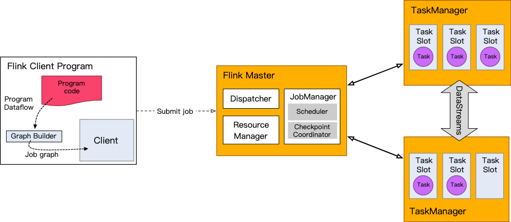

# Mlink
Mlink即Mini Flink，项目初衷是在阅读flink源码过程中，将flink核心特性从复杂的工程项目抽出来，以便更容易理解和学习flink。

# Flink 架构
Flink采用master-salve架构，其中master主要接收client提交job请求，请求资源、分发job等。
Flink master主要有以下三个组件：
* Dispatcher，接收client任务执行请求，为job向ResourceManager请求资源，并未每个job启动一个JobManager。
* ResourceManager，负责管理Flink集群资源。
* JobManager，管理job的整个生命周期。

  
# DatStream API
DataStream API是Flink编写streaming任务的核心API，同时也是SQL和Table API的底层核心支撑。

一个Flink DataStream程序主要包括以下五部分：
1. 获取执行环境(StreamExecutionEnvironment)。
2. 添加数据源(Add source)。
3. 对数据集进行转换操作(Transformation)。
4. 指定数据输出(Add sink)。
5. 触发程序执行(Execute)。

而DataStream API的源码也是从这五方面出发。

## 执行环境
StreamExecutionEnvironment从功能上主要分为两大类：
* 提供了控制程序执行的方法，比如设置并发度、checkpoint设置、执行方式等。
* 与外界进行交互。

而对于DataStream API来说，StreamExecutionEnvironment的主要作用就是创建数据源。