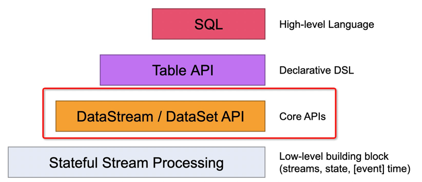
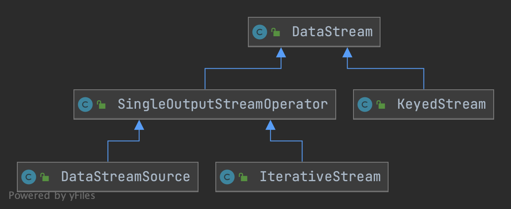
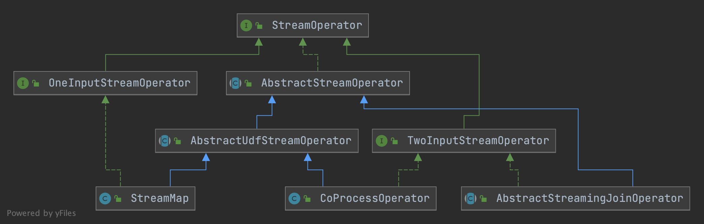
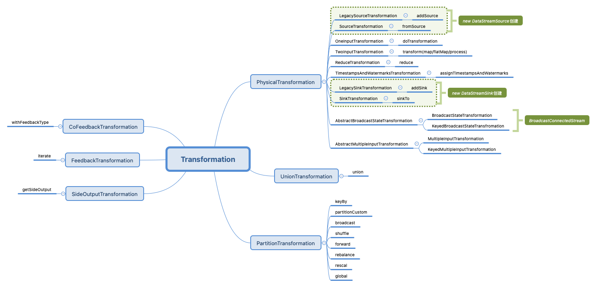
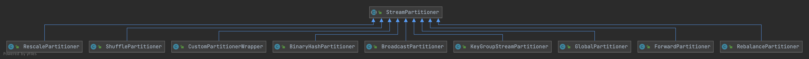
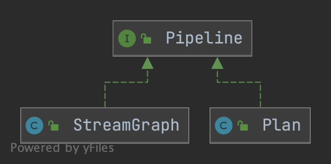
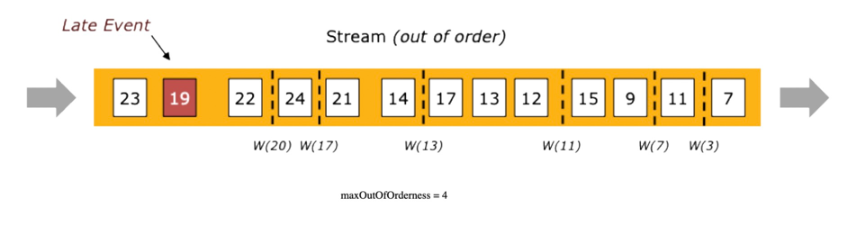
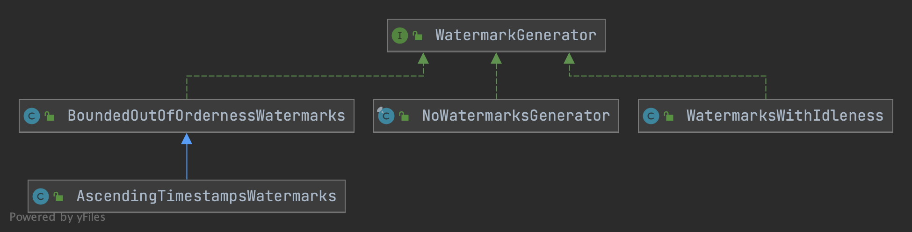
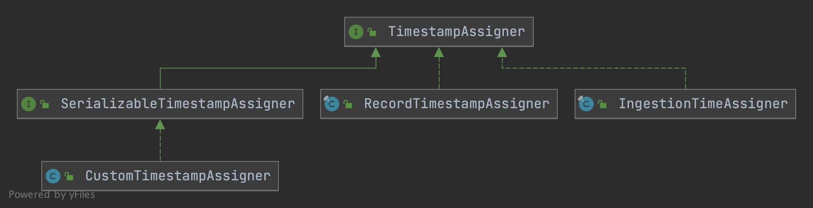

# Mlink
Mlink即Mini Flink，项目初衷是在阅读flink源码过程中，将flink核心特性从复杂的工程项目抽出来，以便更容易理解和学习flink。

比如Operator的源码分布在：flink-core、flink-java、flink-streaming-java等模块中，虽然这样存有它的规则，但是对于源码阅读是非常不方便的。

# DatStream API
DataStream API是Flink编写streaming任务的核心API，同时也是SQL和Table API的底层核心支撑。


> 通过DataStream编程可以实现数据流(data stream)的转换。数据流初始通过各种数据源创建，然后通过DataStream API进程数据流转换操作，最终通过接收器(sink)
接收数据。可以把DataStream看做immutable的数据集，这个数据集可以是有限或无限的，一旦创建它就不能添加和删除元素，而是只能通过DataStream提供API进行数据流处理。

一个Flink DataStream程序主要包括以下五部分：
1. 获取执行环境(StreamExecutionEnvironment)。
2. 添加/创建数据源(Load/Create source)。
3. 对数据集进行转换操作(Transformation)。
4. 指定结果数据输出(Add sink)。
5. 触发程序执行(Execute)。

 >Flink程序是laze execute的，也就是在main方法中只有你触发了execute执行方法，上面添加数据源和各种转换操作才会被执行。应用程序在没触发execute
前的各种操作都是被创建并添加到Dataflow graph中，Flink应用程序作为一个整体执行单元来执行。

而DataStream API的源码也是从这五方面出发。

在看DataStream实现过程中，需要有几个概念需要明白：DataStream、Transformation、StreamOperator、Function和StreamTask。
* DataStream，StreamOperator的抽象，用户可以通过DataStream API来编排Operator。
* StreamOperator，算子的具体实现，但是算子执行逻辑是通过Function指定的。
* Function，算子的具体执行逻辑。
* StreamTask，StreamTask用于执行StreamOperator。
* Transformation，程序执行时，将DataStream转换为StreamGraph。

用一个不恰当的线性表示，可以理解为：
Function -> DataStream -> Operator -> StreamTask
算子执行逻辑传递给DataStream，DataStream将其给到对应的Operator，最后Operator被StreamTask执行。


## 创建执行环境
创建执行环境作为Flink Application的第一步，主要是创建StreamExecutionEnvironment
，根据应用程序是否在本地执行来创建对应的LocalStreamEnvironment和RemoteStreamEnvironment。

StreamExecutionEnvironment内部主要包含以下五部分内容：
 1. 用于构建StreamExecutionEnvironment的静态工厂方法，根据程序是否在本地执行，分别创建LocalStreamEnvironment
    和RemoteStreamEnvironment。
 2. Stream job基础配置，比如算子默认并发度、最大并发度(rescaling上限)、operator chaining、buffer timeout等。
 3. checkpoint相关配置。
 4. 创建data source data stream，核心向addSource方法中传递一个SourceFunction。
 5. 触发程序执行，也就是execute或executeAsync。触发执行首先会根据Transformation来构建StreamGraph。

LocalStreamEnvironment是在本地后台嵌入式启动一个Flink集群，通过多线线程的方式来执行应用程序。LocalStreamEnvironment核心是传递一个local部署配置。
RemoteStreamEnvironment是通过指定远端Flink集群的master(JobManager)节点来提交作业的。

这部分主要有两部分需要剖析：
* StreamGraph如何生成。
* 如何提交执行。

## DataStream
DataStream中定义了对数据流的操作，核心逻辑是接收对应的Function，然后将其传递给对应的Operator
(比如map操作，会将MapFunction给StreamMapOperator)，最后DataStream再将Operator给到Transformation。
com.mlink.api.datastream定义了DataStream相关API，对于DataStream api基础操作主要分为四部分：

* DataStreamSource，由StreamExecutionEnvironment创建source时返回的DataStream。也是通过DataStream
  API编排作业的开始部分。DataStreamSource内部主要接收StreamExecutionEnvironment中指定的source operator。
* DataStream，是DataStream API编排主要操作类，也是DataStreamSource的父类
  (中间还有一个SingleOutputStreamOperator，这里定义感觉比较混乱，里面定义了一些chain策略、并发设置、资源设置等，感觉直接放到DataStream影响不大)。 
  关于DataStream的UML可以看下图1。DataStream中主要定义了operator的各种transformation(比如map、flatMap、reduce等)以及sink操作。
   * 
* ConnectedStreams，对DataStream进行connect操作而创建的stream，可在之上使用CoXxxFunction和keyBy，function执行后在进行数据流合并。
* DataStreamSink，通过对DataStream调用addSink而创建输出数据流。
* KeyedStream，对DataStream使用KeyBy(KeySelector)分区而创建的数据流，可以在此之上运行大部分DataStream操作。



## Function
com.mlink.api.functions定义了Flink中基础Function，主要包括以下Function：
 * Source(com.mlink.api.functions.source)
    * SourceFunction: Source函数接口，自定义source需要实现该接口。
    * FromIteratorFunction：迭代器的source简单实现。
    * SocketTextStreamFunction：socket读取数据简单实现。
 * Transformation(com.mlink.api.functions.transformation)
    * FilterFunction：filter函数接口。
    * MapFunction：map 函数接口。
    * FlatMapFunction：flat map函数接口。
    * ReduceFunction：reduce 函数接口。
 * Sink(com.mlink.api.functions.sink)
    * SinkFunction：Sink函数接口，自定义Sink可以实现该接口。
    * SinkRichFunction：继承了RichFunction，并且实现了SinkFunction接口的抽象类，为Sink函数提供了RichFunction功能。
    * PrintSinkFunction：元素输出sink简单实现。
上面所有函数都实现自Function或RichFunction接口，Function是所有UDF(user-defined functions)的顶级接口，
而RichFunction是对UDF提供了一些丰富功能的Function接口，比如定义了Function内方法的生命周期，可以访问RuntimeContext等。

在com.mlink.api.functions之下除了定义Function外，还定义了Function所用到的RuntimeContext。RuntimeContext包含了Function
执行过程中的所需的上下文信息，比如算子并行度、最大并行度、state等。另外每个Function实例(并发度下的subtask)都有对应的RuntimeContext。
RuntimeContext定义如下(com.mlink.api.functions.context)：
 * RuntimeContext：Context接口定义。
 * StreamingRuntimeContext：为streaming operator实现的RuntimeContext。

## Operator
com.mlink.api.operators定义了Flink中基础的Operator，这里的Operator类型基本和Function一一对应。主要包括以下Operator：
 * Source(com.mlink.api.operators.source)
    * StreamSourceOperator，source operator，用于执行SourceFunction。
 * Transformation(com.mlink.api.operators.transformation)
    * StreamFilterOperator, filter operator，用于执行FilterFunction。
    * StreamMapOperator，map operator，用于执行MapFunction。
    * StreamFlatMapOperator，flatmap operator，用于执行FlatMapFunction。
    * StreamReduceOperator，reduce operator，用于执行ReduceFunction。
 * Sink(com.mlink.api.operators.sink)
    * StreamSinkOperator, sink operator，用于执行SinkFunction。

上面operator所继承的接口或抽象类定义如下：
 * StreamOperator，operator定义顶层接口，定义了operator声明周期。
 * OneInputStreamOperator，实现该接口的算子只有一个输入流。
 * TwoInputStreamOperator，实现该接口的算子有两个输入流。
 * AbstractStreamOperator，所有operator的抽象基类，所有operator都需要实现该抽象方法。如果对应的operator执行的是UDF
则需要实现其子类AbstractUdfStreamOperator。该抽象类对operator生命周期内容进行了默认实现。
 * AbstractUdfStreamOperator，对于执行用户自定义函数(udf)的Operator，需要实现该抽象类。该类将udf的生命周期作为Operator的生命周期一部分。 

对应关系如下，StreamMap(map operator)和CoProcessOperator都是执行udf的operator，分别对应单流和双流输入。而join 
operator抽象基类不是运行udf的operator，所以直接实现了AbstractStreamOperator。


## Transformation
通过DataStream API编程中，每个DataStream的创建(比如map、union、sink等)
都会同时在该DataStream实体上创建一个对应的Transformation，Transformation的入参就包含该Transformation所对应的StreamOperator。

* Transformation：Transformation是所有转换操作的顶级抽象类，记录了当前转换的id、name(用于可视化和log)、outputType
  、parallelism、MaxParallelism、bufferTimeout、资源等信息。该类中定义了两个抽象方法：```getTransitivePredecessors()
  ```和```getInputs()```，分别代表返回包含当前Transformation内的所有上游Transformation列表和返回当前Transformation的直接上游。
* PhysicalTransformation：PhysicalTransformation是Transformation 直接子类，也是大部分算子所对应的转换操作的父类。
  它表示当前是一个具体operator转换，比如map 、flatmap 等等所对应的transformation的父类都是该类。
  PhysicalTransformation还提供了配置Chaining Strategy的抽象方法。
* LegacySourceTransformation：LegacySourceTransformation代表一个source 
  operator。因为没有input，所以没有实际转换操作，但它是拓扑的root。LegacySourceTransformation中TransitivePredecessor
  只包含自身，input为null。
  > Transformation中持有的Operator都是通过StreamOperatorFactory来获取对应的operator的，而不是直接持有operator。
* LegacySinkTransformation，和上面source一样，代表一个stream sink。LegacySinkTransformation入参带有其对应的input 
  Transformation(input的getTransitivePredecessors + 
  this就是当前Transformation的所有转换，而input就是当前Transformation的getInput)。
* SourceTransformation/SinkTransformation：和上面Legacy 
  source/sink对应。不过SourceTransformation和SinkTransformation不对应operator，而是对应目前属于实验阶段的新Source和Sink
  (fromSource和sinkTo)。
* OneInputTransformation：和OneInputStreamOperator相对应。内容基本和LegacySinkTransformation一样。
* TwoInputTransformation：和TwoInputStreamOperator相对应，接收两个input 
  transformation，结果返回一个stream。整体内容和OneInputTransformation一直，只不过对应两个input 
  transformation，所以getInput也就包括了这两个input。
* ReduceTransformation：对应了KeyedStream中的reduce操作，和上面不同的是KeyedStream没有传递一个operator
  ，而是直接将ReduceFunction传递给了ReduceTransformation。其它内容基本和OneInputTransformation一致。
* TimestampsAndWatermarksTransformation：该transformation对应了DataStream.
  assignTimestampsAndWatermarks分配watermark的操作。与上面唯一不同点在于，会将WatermarkStrategy传递给该transformation。
* AbstractBroadcastStateTransformation：broadcast state转换基类。
* BroadcastStateTransformation：是AbstractBroadcastStateTransformation的non-keyed实现。由BroadcastConnectedStream中transform创建。
* KeyedBroadcastStateTransformation：是AbstractBroadStateTransformation的keyed
  实现。与BroadcastStateTransformation唯一不同点在于需要传递一个KeySelector。由BroadcastConnectedStream中transform创建。
* AbstractMultipleInputTransformation/MultipleInputTransformation
  /KeyedMultipleInputTransformation：对应MultipleInputStreamOperator，看源码主要用于table的batch操作。
> 以上都是PhysicalTransformation相关子类实现，会创建对应的物理operator。除了PhysicalTransformation之外，Transformation
> 还包含一些其它直接子类，比如UnionTransformation等。
* UnionTransformation：对多个input transformation进行合并。该转换不会创建物理算子，只会影响上下游算子的连接。该Transformation
  内部实现会接受一个list的Transformation，getInputs和getTransitivePredecessors都是通过该input列表获取。name
  、类型、并发等都是从inputList.get(0)来获取的。该转换由DataStream中union算子创建。
* PartitionTransformation：表示对输入元素进行partition。该转换不会创建物理算子，只会影响上下游算子的连接。PartitionTransformation
  不同于上面，会接收一个```StreamPartition```。该转换由keyBy(KeyedStreams创建)、partitionCustom、broadcast、shuffle、forward、rebalance、rescale、global操作来创建。
* SideOutputTransformation：表示上游算子的旁路输出(side output)
  。该转换不会创建物理算子，只会影响上下游算子的连接。该转换唯一差异点在于入参需要OutputTag。
* FeedbackTransformation：对应迭代流IterativeStream，该Transformation代表拓扑中的一个反馈点(feedback point)
  。该Transformation接收一个input transformation，在该transformation创建feedback point，同时允许你添加多个反馈边
  (feedback edge transformation)。需要注意的是，feedback edge需要和feedback point的并发度一致。
* CoFeedbackTransformation：和FeedbackTransformation功能类似，对应ConnectedIterativeStream。 但是允许返回元素类型和上游transformation
  类型不一致。之所以这样是因为CoFeedbackTransformation之后只会有TwoInputTransformation。在拓扑中上游Transformation
  也不会连接CoFeedbackTransformation，而是直接连接TwoInputTransformation。
  


上面```PartitionTransformation```涉及两个变量这里需要详细说下，分别是用于数据交换的```StreamExchangeMode```
和用于对元素分区的```StreamPartitioner```。
StreamExchangeMode枚举定义了数据在operator间传输的方式：
* PIPELINED：producer和consumer同时在线，producer生产出后的数据立即被consumer消费。
* BATCH：producer生产完整体全部数据后，consumer在启动来消费数据。和MapReduce一样，Map task处理完数据后写中间存储，然后Reduce算子拉起消费处理。
* UNDEFINED：框架根据自身来选择PIPELINED还是BATCH。

StreamPartitioner定义了元素分区策略，也就是上下游operator间建立了通信channel，那么当前元素来了后应该写到哪个channel里面去。
Flink预定义了以下Partition分区策略：
* KeyGroupStreamPartitioner：对应DataStream的keyBy，分区基于KeyGroup。涉及key、当前算子并发、算子最大并发三个变量。
  1. 首先对key求hash(二次hash)，然后对最大并发取余来计算出该key所落在的KeyGroup index上。
  2. 然后计算该keyGroupIndex所归属的operator索引。一个operator 索引对应一个并发task(keyGroupIndex * parallelism / 
     maxParallelism)。
  3. operator 并行度task就对应了keyBy的channel个数，也就选出来了该record发送到哪个channel 并发task上。
* BroadcastPartitioner：对应DataStream的broadcast，用于选择所有输出channel，将元素广播给所有下游。
* ForwardPartitioner：对应DataStream的forward，用于将元素定向发送到本地下游算子task上。
* GlobalPartitioner：对应DataStream的global，用于将所有算子发送到下游operator的第一个task上。
* RebalancePartitioner：对应DataStream的rebalance，通过round-robin模式将元素均匀分给下游所有算子task。
* RescalePartitioner：对应DataStream的rescale，同样通过round-robin模式将元素均匀分给下游，但是相较RebalancePartitioner
  ，该算法取决于上下游并发，比如上游并发2，下游并发4，则第一个并发固定向下游两个算子并发发送元素，另一个同理。(Partitioner实现细节没看出差异)
* ShufflePartitioner：对应DataStream的shuffle，基于Random纯随机选择下游channel。
* CustomPartitioner：对应DataStream的partitionCustom，用于自定义Partitioner。



在构建Transformation过程，主要接收StreamOperatorFactory来创建Operator，即便传递过来的是具体Operator
，也会转换为StreamOperatorFactory。

有了Transformation之后就可以用来构建StreamGraph了。

# 构图
我们通过DataStream API来编排streaming作业后，会通过StreamExecutionEnvironment来触发任务执行(execute)
，而execute的第一步就是生成StreamGraph。在DataStream API中所有创建新算子的操作，都会回调```StreamExecutionEnvironment.
addOperator```方法，而该方法接收的就是算子的transformation。StreamExecutionEnvironment中维护了Transformation的list
，而在生成StreamGraph时就是使用的该Transformation list。

首先我们看下StreamGraph是什么，首先我们Flink具备流批一体的分布式处理引擎，无论流作业还是批作业都会转换成pipeline的形式来执行。目前对于流作业，pipeline
的构建就是通过```StreamGraph```来完成的，而批作业的pipeline是通过```Plan```来构建的(之后流批会统一)。

所以StreamGraph就是Flink中用于构建流式pipeline的流拓扑(streaming topology)，```StreamGraph```包含了构建```JobGraph```的全部信息。



StreamGraph由```StreamNode```和```StreamEdge```组成。
* StreamNode对应了Streaming程序中的一个operator和该operator的所有属性(比如id、operator name、buffer timeout、
  slot sharing group、输入/输出序列化器等)。每个StreamNode内部包含了输入StreamEdge列表和输出StreamEdge列表。值得注意的是StreamNode
  也会被指定执行时所使用的StreamTask(比如SourceStreamTask、OneInputStreamTask等)
  ，该task是在生成StreamGraph时根据operator类型来指定的task类型。
* StreamEdge用于连接两个StreamNode，edge的输入node成为source，输出node成为target。StreamEdge内部主要包括了input/output id
  (sourceId/targetId)、分区器(StreamPartitioner)、buffer timeout以及数据交换方式(StreamExchangeMode)。
* StreamGraph作为主体，内部维护了dag graph的StreamNode信息(edge存储存储在了node的inputEdge和outputEdge)
  ，需要注意的是，StreamGraph中不直接使用StreamNode，而是使用StreamNode的id(vertexID)
  作为索引来使用，该id就是Transformation中的id，从1开始递增生成，保证整个job id唯一。

StreamGraph是由```StreamGraphGenerator```来生成的，StreamGraphGenerator根据DataStream中创建的Transformation 
列表信息来构建StreamGraph。
StreamGraphGenerator的核心方法就是```generate()```来生成StreamGraph。generate内部主要做了两部分事情：
1. 根据配置信息配置StreamGraph，比如：是否chaining、job name、state backend、savepoint目录、全局数据交换方式等。
2. 使用transformation对应的transformation translator对Transformation进行转换。```TransformationTranslator```
   会根据执行模式(batch/streaming)来将transformation转换为运行时实现。TransformationTranslator转换的过程其实就是创建StreamNode
   (调用StreamGraph.addOperator方法)的过程，并且根据Transformation的input(该TF的直接上游)来创建edge(调用StreamGraph.
   addEdge)。

StreamGraphGenerator构图中有两点需要注意：
* StreamGraphGenerator会从sink的Transformation开始递归遍历，来构建StreamGraph(实际源码没有看到从sink遍历的实现，待确定)。
* 对于partitioning、split/select和union操作实际不会创建SteamNode，而是会创建一个虚拟节点(virtual node)
  。并且虚拟节点和下游node之间建立的edge会在之后把虚拟节点抹掉，虚拟节点的下游node会直接和虚拟节点的上游node连接。
  比如有：Map-1 -> HashPartition-2 -> Map-3，这其中数字就是transformation id(上面我们说了从1递增)
  ，对于Map-1会直接转换创建对应的StreamNode(id对应1)。而HashPartition会通过```Transformation.getNewId()```
  来获取一个最新的虚拟ID(也就是4)。然后继续转换最后的Map-3，这时候Map-3会创建和上游的edge，这时候是 HashPartition-4 -> 
  Map-3，在StreamGraph中实际会找HashPartition虚拟节点对应的上游实际节点，也就是Map-1，最终的就是Map-1 -> Map-3。
  
至此StreamGraph完成构建，而StreamExecutionEnvironment中的```execute```接下来就会将该```StreamGraph```交给Client
。Client在将```StreamGraph```转换为```JobGraph``` 。

下面我们再看StreamGraph -> JobGraph前先看下StreamGraph中将Transformation转换StreamGraph(Node/Edge)的Translator。


# Event time和watermark
我们知道Flink支持三种时间类型，分别是：
 * event time：事件发生时间，由产生record的设备标记的时间戳。
 * ingestion time：摄入时间，由Flink摄入record时标记的时间戳。
 * processing time：处理时间，具体Operator在处理数据时标记的时间戳。

三种时间格式，定义在com.mlink.api.TimeCharacteristic枚举类中。

对于计算逻辑需要根据事件具体发生的时间来计算的逻辑，就需要通过event time来进行处理了。而在Flink中使用event 
time，需要借助Timestamp提取器和Watermark生成器。
Timestamp提取器比较容易理解，就是在source节点接收数据时，根据用户指定的字段来抽取record中event timestamp。但是watermark又是用来干什么的？

## Watermark
Watermark是用来处理乱序数据流和迟到数据(乱序数据流和迟到数据基本一个意思)的一种机制。
对于乱序数据或者迟到数据我们最难的是如何判断数据迟到多久，不同的事件的延迟可能都不相同，所以可能有些事件比其它事件迟到的更多。 
一种简单的方式就是通过假设所有延迟事件都不超过一个最大的延迟某个最大的延迟限制。这就是Flink中的Watermark策略。

可以看到Watermark是一种在延迟和数据完整性上进行权衡的策略。Watermark设置的越长，结果可能更完整，但是计算结果的延迟就越高。相反，Watermark
设置的比较短，计算生成结果比较快，但是计算结果可能不是很完整。


在Watermark机制中，延迟(Lateness)的定义是相对Watermark的(延迟参照物是定义的Watermark)，比如在Watermark(t)
触发后，所有<=t的时间都被称为延迟事件(Late event)。
> 这个T并不是event的实际Timestamp，而是event timestamp + Watermark计算规则得出的。
> 比如使用maxOutOfOrderness，则t = event timestamp - maxOutOfOrderness。 Watermark(t)
> 代表了之后没有事件时间小于t的事件了，也就是t代表了数据流中事件时间的进度。


下图是Watermark在作业运行过程中的具体形式，Watermark生成器向pipeline中发送watermark 
event，节点算子接收到Watermark后更新自身算子的时间(TimeService)，这样算子就知道自己应该处理什么时间的数据了。


### Watermark策略
既然Event time通过Watermark来尽量保证数据完整性，那在使用EventTime就需要使用上面所说的时间戳指定器和Watermark生成器。Flink
将二者封装到了WatermarkStrategy中了，WatermarkStrategy是一个策略接口，同时提供了一些timestamp assigner和watermark 
generator的默认实现。
上面我们说过StreamExecutionEnvironment中创建DataSourceStream最终都是通过addSource(执行自定义SourceFunction)
和fromSource方法(执行Source connector)。在addSource中由SourceFunction直接定义发送Watermark方法，fromSource
接收指定的WatermarkStrategy(因为fromSource的source function实际就是各外部数据源，没办法自己实现function发射)。


### Watermark generator
WatermarkGenerator接口定义了Watermark两个发射方法，一般二者结合使用。
```java
public interface WatermarkGenerator<T> {
    
    //每个event都会调用该方法
    void onEvent(T event, long eventTimestamp, WatermarkOutput output);
    //定时调用该方法
    void onPeriodicEmit(WatermarkOutput output);
}
```
下面是WatermarkGenerator提供的一些主要默认实现：
 * BoundedOutOfOrdernessWatermarks：用于处理无序数据的Generator
  ，可以为无序数据设置一个无序程度的上限。这就是我们上面举的例子：无序上限边界outOfOrdernessMills，当遇到event time为t的事件时，说明当前不会再有事件晚于event
 time - outOfOrdernessMs了。该生成器，并不会为每个event都发送一个Watermark，而是通过onPeriodicEmit周期发送。所以，最大延迟时间=周期时间间隔 
+ outOfOrdernessMs。
 * AscendingTimestampsWatermarks：是BoundedOutOfOrdernessWatermarks的子类，将outOfOrdernessMs设置了0
  。也就是该Generator认为数据时间戳都是单调递增的(不存在任何数据延迟)。这个类的含义就是，延迟时间=Watermark周期间隔，只要event time小于周期间隔，都是延迟数据。
 * NoWatermarksGenerator：不发送Watermark的实现，一般用于process time处理。
 * WatermarkWithIdleness：空闲检测，如果空闲时间内没有event，则不发送Watermark。它不直接发送Watermark，而是接收一个Generator
   让其操作。



### Timestamp assigner
时间戳分配器就比较好理解了，就是用于抽取event中的event time的组件。TimestampAssignor也只定义了一个抽取时间戳的方法。
```java
public interface TimestampAssigner<T> {

    //recordTimestamp为之前提取器提取出来的，不需要二次提取直接使用，比如kafka中已经提取该事件戳
    long extractTimestamp(T element, long recordTimestamp);
}
```
TimestampAssigner默认可用实现比较少：
* SerializableTimestampAssigner：实现了TimestampAssigner和Serialization，目的是创建可序列化的时间戳分配器，主要用于跨语言。
* CustomTimestampAssigner：SerializableTimestampAssigner子类实现，用于python function。
* RecordTimestampAssignor：直接使用recordTimestamp作为event 
  time的实现。也是WatermarkStrategy中TimestampAssigner方法默认实现。
* IngestionTimeAssigner：使用机器时钟作为分配的Timestamp，也是ingestion time语义实现。



在Flink中有两个地方可以使用Watermark，分为为：直接在source之上使用和非source operator之后。一般使用采用第一种，第二种只有在第一种方式无法使用的情况下使用。

Watermark独立使用实际是没有意义的，一般是结合窗口一起使用。通过Watermark来控制window的窗口触发时机。

# window
## WindowAssigner
WindowAssigner负责将每个传入的元素分配到一个或多个window里面。Flink为最常用的用例，提供了预定义是的窗口分配器，
即：滚动窗口(tumbling window)、滑动窗口(sliding window)、会话窗口(session window)和全局窗口(global window)。除了global 
window其它窗口都是基于时间的窗口。时间窗口都由[startTime, endTime)来划分窗口，注意不包括endTime。

窗口分配器通过实现```WindowAssigner```来为元素分配窗口的，也就是每个元素都通过WindowAssigner来分配一个或多个窗口。
预定义窗口如下：
* TumblingEventTimeWindows、TumblingProcessTimeWindows：用于生成滚动窗口，也就是每个element只会归属到一个window内。
* SlidingEventTimeWindows、SlidingProcessTimeWindows：用于生成滑动窗口，每个element会被分配到 windowSize / 
  windowSlide个窗口内。
* SessionEventTime(/ProcessingTime)Windows、DynamicSessionEventTimeWindows，用于会话窗口，
如果消息之后超过指定timeout还没有消息到达，则关闭当前会话窗口。会话窗口是为每个element都分配一个window，起始时间为element的time，终止时间为timeout
  时间。之后将timeout内间隔的窗口都会merge到一个窗口内。
* GlobalWindows：全局窗口，该窗口不是基于时间的窗口，没有起始、终止时间，所有时刻元素都会发送到这个窗口，该窗口不会触发close，需要借助trigger触发Function计算。

> flink内部Session窗口命名为EventTimeSessionWindows、ProcessingTimeSessionWindows这种命名和其它窗口并没有统一。

## Trigger
Trigger用于确定窗口内容已经准备好，可以将窗口元素交给窗口函数进行计算并发送给下游。
触发器核心接口即```Trigger```，Trigger负责触发是否执行计算函数主要有三个方法：onElement、onEventTime和onProcessingTime。
onElement在接收每个元素都会触发该方法，onEventTime和onProcessingTime在通过Trigger的TriggerContext注册对应时间时调用。
这三个方法都返回```TriggerResult```，TriggerResult枚举类定义了是否触发窗口函数计算，下面是枚举值：
```java
public enum TriggerResult {

    //不做任何处理，窗口继续接收数据
    CONTINUE(false, false),
    //触发窗口函数计算，并将结果发送下游。计算完成后，清除窗口数据
    FIRE_AND_PURGE(true, true),
    //触发窗口函数计算，并将结果发送下游，窗口数据保留
    FIRE(true, false),
    //清楚窗口中数据
    PURGE(false, true);

    private final boolean fire;
    private final boolean purge;
}
```
Flink默认提供了以下几个预定义Trigger实现类：
* EventTimeTrigger，是所有Event类型窗口(比如TumblingEventTimeWindows)的默认触发器，以Watermark到达窗口末尾为触发窗口计算逻辑。
* ProcessingTimeTrigger，所有ProcessingTime类型窗口默认触发器，以调用onProcessingTime作为窗口触发计算(向TriggerContext注册处理时间)
* CounterTrigger，计数触发器，内部通过状态管理来维护count，当到达指定个数触发函数计算。
* PurgingTrigger，清除触发器，以其它触发器作为计算触发规则(构造函数接收其它触发器)，当其它触发器触发计算，则该触发器返回FIRE_AND_PURGE。

## Evictor
Flink window模型除了可以使用WindowAssigner和Trigger外，还可以使用Evictor。Evictor能够在Trigger触发后和窗口计算前后来移除窗口元素。
Evictor内部两个方法：evictBefore用于在窗口函数执行前执行，evictAfter用于在窗口函数执行后调用执行。
Flink预定义了一下三个evictor：
* TimeEvictor：用于移除窗口内current_time - keep_time前的元素，current time为当前窗口所有元素最大时间戳，keep_time为传递参数。
* CountEvictor：保留指定数量的元素，超过count则会被移除。
* DeltaEvictor：基于DeltaFunction和threshold的驱逐实现(没太理解这个到底用来干嘛)。

> 使用evictor会禁止预计算，因为所有元素要先给evictor。另外，因为Flink不保证窗口内元素顺序，所以被驱逐的元素不一定就是窗口头部或尾部元素。

## Allow Lateness
对于基于event time的窗口，数据可能延迟到达，也就是跟踪事件时间的Watermark已经超过了元素所属窗口结束时间戳。在默认情况下，如果Watermark
超过窗口末尾时，则后续属于该窗口的延迟数据会被全部删除，Flink允许设置一个Allow 
Lateness，也就是当Watermark超过窗口末尾后，对于设置的延迟时间内数据不会被删除，而是在去触发窗口计算(取决于Trigger实现)。
直白一点就是Allow Lateness为Watermark过期数据设置了一个能够允许的延迟时间。

因为延迟数据会再触发窗口计算(比如计算结果重新发送给下游)，这种数据应该被视为先前计算的更新结果，应用程序应该处理这类重复数据。

借助side output特性，可以获取延迟丢弃的数据流。


# Side output
Flink提供的side output能够在DataStream操作结果之外，额外添加多个旁路输出流(side output stream)。这些side output 
stream可以和DataStream中结果数据类型不一样，同时不同side output间类型也可以不一样。
side output通过OutputTag来标识一个旁路输出流，OutputTag除了有唯一ID外，还有该side output所对应的接收数据类型。

使用Side output有两个步骤。第一步通过以下Function的Context来注册一个side 
output；第二步通过DataStream的getSideOutput方法来获取之前注册的side output(返回的是DataStream)，然后对其操作。

* ProcessFunction
* KeyedProcessFunction
* CoProcessFunction
* KeyedCoProcessFunction
* ProcessWindowFunction
* ProcessAllWindowFunction

# RPC
## akka
我们知道Flink集群节点间数据通信是通过akka来完成的。akka是actor模型在scala/java上的实现，用于构建弹性、可扩展、快速响应的分布式应用程序。使用akka具有以下优势：
 * 屏蔽复杂的多线程和锁操作。
 * 天然并发和响应式系统，可以轻松高吞吐、高并发能力(单机百万actor)。
 * 具备容错处理能力，可以自定义容错处理机制。

> Actor模型，actor模型是一种并发计算模型，actor是该模型的抽象，是并发计算的基本单位。一个actor接收到消息后，可以做一系列决策：
>  * 创建更多actor。
>  *