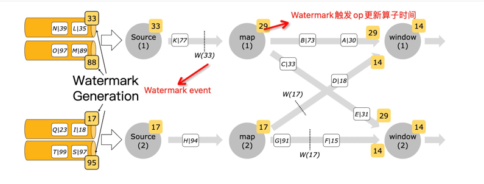

# Mlink
Mlink即Mini Flink，项目初衷是在阅读flink源码过程中，将flink核心特性从复杂的工程项目抽出来，以便更容易理解和学习flink。

比如Operator的源码分布在：flink-core、flink-java、flink-streaming-java等模块中，虽然这样存有它的规则，但是对于源码阅读是非常不方便的。

# DatStream API
DataStream API是Flink编写streaming任务的核心API，同时也是SQL和Table API的底层核心支撑。


一个Flink DataStream程序主要包括以下五部分：
1. 获取执行环境(StreamExecutionEnvironment)。
2. 添加数据源(Add source)。
3. 对数据集进行转换操作(Transformation)。
4. 指定数据输出(Add sink)。
5. 触发程序执行(Execute)。

而DataStream API的源码也是从这五方面出发。

在看DataStream实现过程中，需要有几个概念需要明白：DataStream、Transformation、StreamOperator、Function和StreamTask。
* DataStream，StreamOperator的抽象，用户可以通过DataStream API来编排Operator。
* StreamOperator，算子的具体实现，但是算子执行逻辑是通过Function指定的。
* Function，算子的具体执行逻辑。
* StreamTask，StreamTask用于执行StreamOperator。
* Transformation，程序执行时，将DAG转换为StreamGraph。

用一个不恰当的线性表示，可以理解为：
Function -> DataStream -> Operator -> StreamTask
算子执行逻辑传递给DataStream，DataStream将其给到对应的Operator，最后Operator被StreamTask执行。

## Function
com.mlink.api.functions定义了Flink中基础Function，主要包括以下Function：
 * Source(com.mlink.api.functions.source)
    * SourceFunction: Source函数接口，自定义source需要实现该接口。
    * FromIteratorFunction：迭代器的source简单实现。
    * SocketTextStreamFunction：socket读取数据简单实现。
 * Transformation(com.mlink.api.functions.transformation)
    * FilterFunction：filter函数接口。
    * MapFunction：map 函数接口。
    * FlatMapFunction：flat map函数接口。
    * ReduceFunction：reduce 函数接口。
 * Sink(com.mlink.api.functions.sink)
    * SinkFunction：Sink函数接口，自定义Sink可以实现该接口。
    * SinkRichFunction：继承了RichFunction，并且实现了SinkFunction接口的抽象类，为Sink函数提供了RichFunction功能。
    * PrintSinkFunction：元素输出sink简单实现。
上面所有函数都实现自Function或RichFunction接口，Function是所有UDF(user-defined functions)的顶级接口，
而RichFunction是对UDF提供了一些丰富功能的Function接口，比如定义了Function内方法的生命周期，可以访问RuntimeContext等。

在com.mlink.api.functions之下除了定义Function外，还定义了Function所用到的RuntimeContext。RuntimeContext包含了Function
执行过程中的所需的上下文信息，比如算子并行度、最大并行度、state等。另外每个Function实例(并发度下的subtask)都有对应的RuntimeContext。
RuntimeContext定义如下(com.mlink.api.functions.context)：
 * RuntimeContext：Context接口定义。
 * StreamingRuntimeContext：为streaming operator实现的RuntimeContext。

## Operator
com.mlink.api.operators定义了Flink中基础的Operator，这里的Operator类型基本和Function一一对应。主要包括以下Operator：
 * Source(com.mlink.api.operators.source)
    * StreamSourceOperator，source operator，用于执行SourceFunction。
 * Transformation(com.mlink.api.operators.transformation)
    * StreamFilterOperator, filter operator，用于执行FilterFunction。
    * StreamMapOperator，map operator，用于执行MapFunction。
    * StreamFlatMapOperator，flatmap operator，用于执行FlatMapFunction。
    * StreamReduceOperator，reduce operator，用于执行ReduceFunction。
 * Sink(com.mlink.api.operators.sink)
    * StreamSinkOperator, sink operator，用于执行SinkFunction。

上面operator所继承的接口或抽象类定义如下：
 * StreamOperator，operator定义顶层接口，定义了operator声明周期。
 * OneInputStreamOperator，实现该接口的算子只有一个输入流。
 * TwoInputStreamOperator，实现该接口的算子有两个输入流。
 * AbstractStreamOperator，所有operator的抽象基类，所有operator都需要实现该抽象方法。如果对应的operator执行的是UDF
则需要实现其子类AbstractUdfStreamOperator。该抽象类对operator生命周期内容进行了默认实现。
 * AbstractUdfStreamOperator，对于执行用户自定义函数(udf)的Operator，需要实现该抽象类。该类将udf的生命周期作为Operator的生命周期一部分。 

对应关系如下，StreamMap(map operator)和CoProcessOperator都是执行udf的operator，分别对应单流和双流输入。而join 
operator抽象基类不是运行udf的operator，所以直接实现了AbstractStreamOperator。


## DataStream
DataStream中定义了对数据流的操作，核心逻辑是接收对应的Function，然后将其传递给对应的Operator
(比如map操作，会将MapFunction给StreamMapOperator)，最后DataStream再将Operator给到Transformation。
com.mlink.api.datastream定义了DataStream相关API，对于DataStream api基础操作主要分为四部分：
 * DataStreamSource，由StreamExecutionEnvironment创建source时返回的DataStream。也是通过DataStream 
   API编排作业的开始部分。DataStreamSource内部主要有两个构造方法，分别接收source operator和source connector来指定数据源。
 * DataStream，包括了DataStream的转换操作(比如map、flatMap、reduce等)以及sink操作。
 * DataStreamSink，通过对DataStream调用addSink而创建输出数据流。
 * KeyedStream，对DataStream使用KeyBy(KeySelector)分区而创建的数据流，可以在此之上运行大部分DataStream操作。

## Transformation
上面我们说过，Transformation用于将DAG作业转换为StreamGraph以便后续转成JobGraph来执行。Transformation和Operator基本相对应。
com.mlink.api.transformation定义了Transformation相关的代码，主要包括以下几类：
 * SourceTransformation，对应source connector的Transformation。
 * SinkTransformation，对应sink connector的Transformation。
 * OneInputTransformation，对应OneInputStreamOperator的Transformation。
 * TwoInputTransformation，对应TwoInputStreamOperator的Transformation。

上面实现类实现了Transformation抽象基类和PhysicalTransformation抽象基类。PhysicalTransformation
对应了我们的所使用的各类物理Operator。比如source、map、sink等等。

在构建Transformation过程，现在主要接收StreamOperatorFactory来创建Operator，即便传递过来的是具体Operator
，也会转换为StreamOperatorFactory。所以这里在com.mlink.api.operators下面引入了operator factory实现。


## 执行环境
StreamExecutionEnvironment从功能上主要分为两大类：
* 提供了控制程序执行的方法，比如设置并发度、checkpoint设置、执行方式等。
* 与外界进行交互。

而对于DataStream API来说，StreamExecutionEnvironment的主要作用就是创建数据源。

# Event time和watermark
我们知道Flink支持三种时间类型，分别是：
 * event time：事件发生时间，由产生record的设备标记的时间戳。
 * ingestion time：摄入时间，由Flink摄入record时标记的时间戳。
 * processing time：处理时间，具体Operator在处理数据时标记的时间戳。

三种时间格式，定义在com.mlink.api.TimeCharacteristic枚举类中。

对于计算逻辑需要根据事件具体发生的时间来计算的逻辑，就需要通过event time来进行处理了。而在Flink中使用event 
time，需要借助Timestamp提取器和Watermark生成器。
Timestamp提取器比较容易理解，就是在source节点接收数据时，根据用户指定的字段来抽取record中event timestamp。但是watermark又是用来干什么的？

## Watermark
Watermark是用来处理乱序数据流和迟到数据(乱序数据流和迟到数据基本一个意思)的一种机制。
对于乱序数据或者迟到数据我们最难的是如何判断数据迟到多久，不同的事件的延迟可能都不相同，所以可能有些事件比其它事件迟到的更多。 
一种简单的方式就是通过假设所有延迟事件都不超过一个最大的延迟某个最大的延迟限制。这就是Flink中的Watermark策略。

可以看到Watermark是一种在延迟和数据完整性上进行权衡的策略。Watermark设置的越长，结果可能更完整，但是计算结果的延迟就越高。相反，Watermark
设置的比较短，计算生成结果比较快，但是计算结果可能不是很完整。


在Watermark机制中，延迟(Lateness)的定义是相对Watermark的(延迟参照物是定义的Watermark)，比如在Watermark(t)
触发后，所有<=t的时间都被称为延迟事件(Late event)。
> 这个T并不是event的实际Timestamp，而是event timestamp + Watermark计算规则得出的。
> 比如使用maxOutOfOrderness，则t = event timestamp - maxOutOfOrderness。 Watermark(t)
> 代表了之后没有事件时间小于t的事件了，也就是t代表了数据流中事件时间的进度。


下图是Watermark在作业运行过程中的具体形式，Watermark生成器向pipeline中发送watermark 
event，节点算子接收到Watermark后更新自身算子的时间(TimeService)，这样算子就知道自己应该处理什么时间的数据了。


### Watermark策略
既然Event time通过Watermark来尽量保证数据完整性，那在使用EventTime就需要使用上面所说的时间戳指定器和Watermark生成器。Flink
将二者封装到了WatermarkStrategy中了，WatermarkStrategy是一个策略接口，同时提供了一些timestamp assigner和watermark 
generator的默认实现。
上面我们说过StreamExecutionEnvironment中创建DataSourceStream最终都是通过addSource(执行自定义SourceFunction)
和fromSource方法(执行Source connector)。在addSource中由SourceFunction直接定义发送Watermark方法，fromSource
接收指定的WatermarkStrategy(因为fromSource的source function实际就是各外部数据源，没办法自己实现function发射)。


### Watermark generator
WatermarkGenerator接口定义了Watermark两个发射方法，一般二者结合使用。
```java
public interface WatermarkGenerator<T> {
    
    //每个event都会调用该方法
    void onEvent(T event, long eventTimestamp, WatermarkOutput output);
    //定时调用该方法
    void onPeriodicEmit(WatermarkOutput output);
}
```
下面是WatermarkGenerator提供的一些主要默认实现：
 * BoundedOutOfOrdernessWatermarks：用于处理无序数据的Generator
  ，可以为无序数据设置一个无序程度的上限。这就是我们上面举的例子：无序上限边界outOfOrdernessMills，当遇到event time为t的事件时，说明当前不会再有事件晚于event
 time - outOfOrdernessMs了。该生成器，并不会为每个event都发送一个Watermark，而是通过onPeriodicEmit周期发送。所以，最大延迟时间=周期时间间隔 
+ outOfOrdernessMs。
 * AscendingTimestampsWatermarks：是BoundedOutOfOrdernessWatermarks的子类，将outOfOrdernessMs设置了0
  。也就是该Generator认为数据时间戳都是单调递增的(不存在任何数据延迟)。这个类的含义就是，延迟时间=Watermark周期间隔，只要event time小于周期间隔，都是延迟数据。
 * NoWatermarksGenerator：不发送Watermark的实现，一般用于process time处理。
 * WatermarkWithIdleness：空闲检测，如果空闲时间内没有event，则不发送Watermark。它不直接发送Watermark，而是接收一个Generator
   让其操作。


### Timestamp assigner
时间戳分配器就比较好理解了，就是用于抽取event中的event time的组件。TimestampAssignor也只定义了一个抽取时间戳的方法。
```java
public interface TimestampAssigner<T> {

    //recordTimestamp为之前提取器提取出来的，不需要二次提取直接使用，比如kafka中已经提取该事件戳
    long extractTimestamp(T element, long recordTimestamp);
}
```
TimestampAssigner默认可用实现比较少：
* SerializableTimestampAssigner：实现了TimestampAssigner和Serialization，目的是创建可序列化的时间戳分配器，主要用于跨语言。
* CustomTimestampAssigner：SerializableTimestampAssigner子类实现，用于python function。
* RecordTimestampAssignor：直接使用recordTimestamp作为event 
  time的实现。也是WatermarkStrategy中TimestampAssigner方法默认实现。
* IngestionTimeAssigner：使用机器时钟作为分配的Timestamp，也是ingestion time语义实现。


在Flink中有两个地方可以使用Watermark，分为为：直接在source之上使用和非source operator之后。一般使用采用第一种，第二种只有在第一种方式无法使用的情况下使用。

Watermark独立使用实际是没有意义的，一般是结合窗口一起使用。通过Watermark来控制window的窗口触发时机。

# window
## WindowAssigner
WindowAssigner负责将每个传入的元素分配到一个或多个window里面。Flink为最常用的用例，提供了预定义是的窗口分配器，
即：滚动窗口(tumbling window)、滑动窗口(sliding window)、会话窗口(session window)和全局窗口(global window)。除了global 
window其它窗口都是基于时间的窗口。时间窗口都由[startTime, endTime)来划分窗口，注意不包括endTime。

窗口分配器通过实现```WindowAssigner```来为元素分配窗口的，也就是每个元素都通过WindowAssigner来分配一个或多个窗口。
预定义窗口如下：
* TumblingEventTimeWindows、TumblingProcessTimeWindows：用于生成滚动窗口，也就是每个element只会归属到一个window内。
* SlidingEventTimeWindows、SlidingProcessTimeWindows：用于生成滑动窗口，每个element会被分配到 windowSize / 
  windowSlide个窗口内。
* SessionEventTime(/ProcessingTime)Windows、DynamicSessionEventTimeWindows，用于会话窗口，
如果消息之后超过指定timeout还没有消息到达，则关闭当前会话窗口。会话窗口是为每个element都分配一个window，起始时间为element的time，终止时间为timeout
  时间。之后将timeout内间隔的窗口都会merge到一个窗口内。
* GlobalWindows：全局窗口，该窗口不是基于时间的窗口，没有起始、终止时间，所有时刻元素都会发送到这个窗口，该窗口不会触发close，需要借助trigger触发Function计算。

> flink内部Session窗口命名为EventTimeSessionWindows、ProcessingTimeSessionWindows这种命名和其它窗口并没有统一。

## Trigger
Trigger用于确定窗口内容已经准备好，可以将窗口元素交给窗口函数进行计算并发送给下游。
触发器核心接口即```Trigger```，Trigger负责触发是否执行计算函数主要有三个方法：onElement、onEventTime和onProcessingTime。
onElement在接收每个元素都会触发该方法，onEventTime和onProcessingTime在通过Trigger的TriggerContext注册对应时间时调用。
这三个方法都返回```TriggerResult```，TriggerResult枚举类定义了是否触发窗口函数计算，下面是枚举值：
```java
public enum TriggerResult {

    //不做任何处理，窗口继续接收数据
    CONTINUE(false, false),
    //触发窗口函数计算，并将结果发送下游。计算完成后，清除窗口数据
    FIRE_AND_PURGE(true, true),
    //触发窗口函数计算，并将结果发送下游，窗口数据保留
    FIRE(true, false),
    //清楚窗口中数据
    PURGE(false, true);

    private final boolean fire;
    private final boolean purge;
}
```
Flink默认提供了以下几个预定义Trigger实现类：
* EventTimeTrigger，是所有Event类型窗口(比如TumblingEventTimeWindows)的默认触发器，以Watermark到达窗口末尾为触发窗口计算逻辑。
* ProcessingTimeTrigger，所有ProcessingTime类型窗口默认触发器，以调用onProcessingTime作为窗口触发计算(向TriggerContext注册处理时间)
* CounterTrigger，计数触发器，内部通过状态管理来维护count，当到达指定个数触发函数计算。
* PurgingTrigger，清除触发器，以其它触发器作为计算触发规则(构造函数接收其它触发器)，当其它触发器触发计算，则该触发器返回FIRE_AND_PURGE。

## Evictor
Flink window模型除了可以使用WindowAssigner和Trigger外，还可以使用Evictor。Evictor能够在Trigger触发后和窗口计算前后来移除窗口元素。
Evictor内部两个方法：evictBefore用于在窗口函数执行前执行，evictAfter用于在窗口函数执行后调用执行。
Flink预定义了一下三个evictor：
* TimeEvictor：用于移除窗口内current_time - keep_time前的元素，current time为当前窗口所有元素最大时间戳，keep_time为传递参数。
* CountEvictor：保留指定数量的元素，超过count则会被移除。
* DeltaEvictor：基于DeltaFunction和threshold的驱逐实现(没太理解这个到底用来干嘛)。

> 使用evictor会禁止预计算，因为所有元素要先给evictor。另外，因为Flink不保证窗口内元素顺序，所以被驱逐的元素不一定就是窗口头部或尾部元素。

## Allow Lateness
对于基于event time的窗口，数据可能延迟到达，也就是跟踪事件时间的Watermark已经超过了元素所属窗口结束时间戳。在默认情况下，如果Watermark
超过窗口末尾时，则后续属于该窗口的延迟数据会被全部删除，Flink允许设置一个Allow 
Lateness，也就是当Watermark超过窗口末尾后，对于设置的延迟时间内数据不会被删除，而是在去触发窗口计算(取决于Trigger实现)。
直白一点就是Allow Lateness为Watermark过期数据设置了一个能够允许的延迟时间。

因为延迟数据会再触发窗口计算(比如计算结果重新发送给下游)，这种数据应该被视为先前计算的更新结果，应用程序应该处理这类重复数据。

借助side output特性，可以获取延迟丢弃的数据流。


# RPC
## akka
我们知道Flink集群节点间数据通信是通过akka来完成的。akka是actor模型在scala/java上的实现，用于构建弹性、可扩展、快速响应的分布式应用程序。使用akka具有以下优势：
 * 屏蔽复杂的多线程和锁操作。
 * 天然并发和响应式系统，可以轻松高吞吐、高并发能力(单机百万actor)。
 * 具备容错处理能力，可以自定义容错处理机制。

> Actor模型，actor模型是一种并发计算模型，actor是该模型的抽象，是并发计算的基本单位。一个actor接收到消息后，可以做一系列决策：
>  * 创建更多actor。
>  *